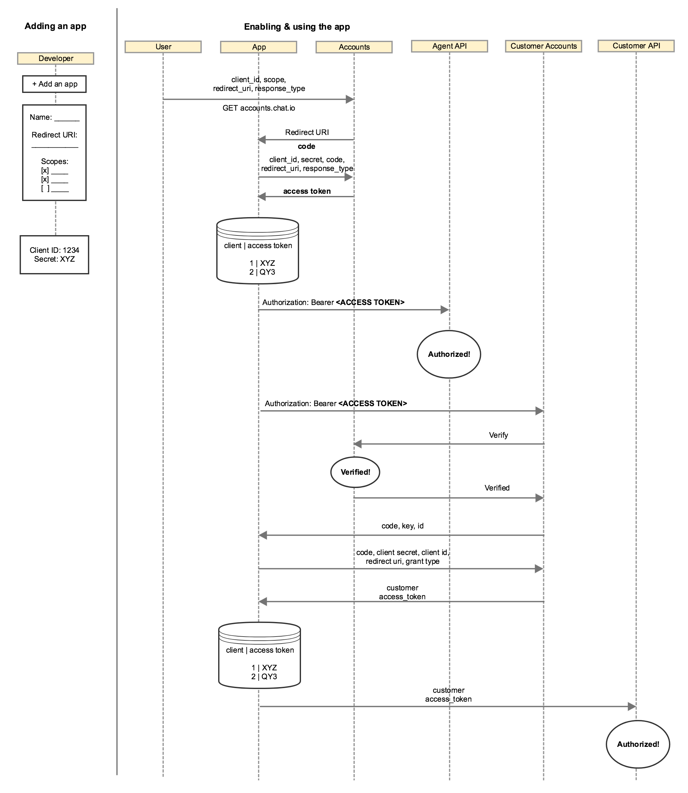

# Customer authorization flow

To authorize [Customer API](../customer-api/) you will need different access token than for the [Agent API](../agent-api/) or [Configuration API](../configuration-api). The flow is similar to the one presented for server-side apps.

## Obtaining customer code

To get customer access token, you will need the customer code. 

### Creating new customer

You can create a new customer on licence or use an existing identity. The `<ACCESS_TOKEN>` mentioned below is the one that you get from the app authorization flow.

```
POST https://accounts.chat.io/customer/ -H "Authorization: Bearer <ACCESS_TOKEN>"
```

**Required parameters**

* `client_id` - identifies the client application that is making the request 
* `response_type` - oauth2 standard, should use code
* `redirect_uri`  - the value of this parameter must exactly match one of the values listed in application 

**Optional partametres**

* `customer_id` - ID of existing customer
* `customer_key` - Customer credential key

**Example response**
```
{
    "code": "dev-J7ssSZhSSbShcZxrv580FA",
    "customer_id": "bf18d1a8-1afe-4a3e-4cc0-a3148f1143db",
    "customer_key": "8ba71a350771a58f0e67f70e815f7525",
    "state": ""
}
```
Your application should save `customer_id` and `customer_key` for further use. 

### Other scenarios

1. To obtain new `customer_id`, `customer_key` and `code`, your application should send request with required parameters only.

2. To generate new `code` for existing customer, your application should send `customer_id` and `customer_key`.

3. To generate new `code` for existing customer having only `customer_id`, your application should send `customer_id` (possible only for integration `access_token` with `customers.manage--identity` scope)

## Obtaining customer access token

Once you have the `code` assigned to a specific customer, you need to exchange it for a `access_token`. The flow is almost identical as for the [Server-side apps](#server-side-apps). The only differences are the exact endpoint address and the lack of refresh token.

To exchange the `code` for an `access_token`, you should perform an HTTP POST request to the following URL:

`https://accounts.chat.io/customer/token`

Required parameters:

* **grant_type=authorization_code**
* **code** – the authorization code returned from the initial request.
* **client_id** – you received it when you created the app in [Developers Console](https://console.chat.io).
* **client_secret** - you received it when you created the app in [Developers Console](https://console.chat.io).
* **redirect_uri** – URL of your web application that chat.io OAuth Server will redirect the user back after successful authorization. It must be one of the URLs that you entered when creating the app in the previous step.

**Example request**:

```shell
curl "https://accounts.chat.io/customer/token" \
  -X POST \
  -d "grant_type=authorization_code&\
  code=dev-J7ssSZhSSbShcZxrv580FA&\
  client_id=86pp8cqeg2ac5fimbs8gibluu16ugyvs&\
  client_secret=nBdMN8d7MEp1YYo3&\
  redirect_uri=https://my-application.com"
```


**Example response**:

```json
{
  "access_token": "1/fFAGRNJru1FTz70BzhT3Zg",
  "expires_in": 3920,
  "token_type": "Bearer"
}
```

The response will include the following params in JSON format:

* **access_token** – token you can use to call [REST API](/rest-api) methods on behalf of the user.
* **expires_in** – number of seconds the `access_token` will be valid. When it expires, you will need to generate new `access_token` using `refresh_token` (read [Using the refresh token](#using-the-refresh-token) for more details).
* **token_type=Bearer**

### Customer authorization diagram



