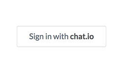
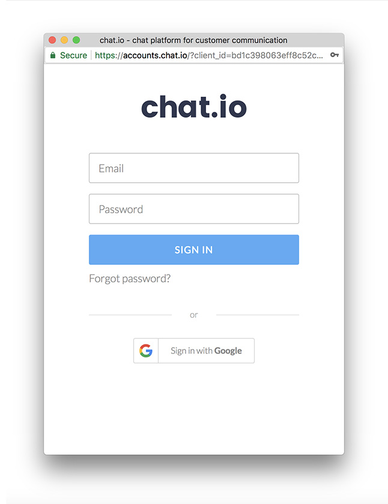

# Introduction

"Sign in with chat.io" option is the easiest way to get access to basic information about chat.io users. It allows you to quickly build an app that can access different parts of a chat.io account.

## User flow

Here's the basic flow of signing in with chat.io:

#### Step 1

A user starts the flow by clicking the following button:

#### Step 2

If the user is not signed in to chat.io, they are asked to do so:

#### Step 3

Finally, the app receives `access_token` which allows it to fetch user's email and license number.

## Use cases

With "Sign in with chat.io" flow, you can easily build an app which:

* has access to chat.io user's email or license number,
* will receive `access_token` that can be used to make various API calls.
